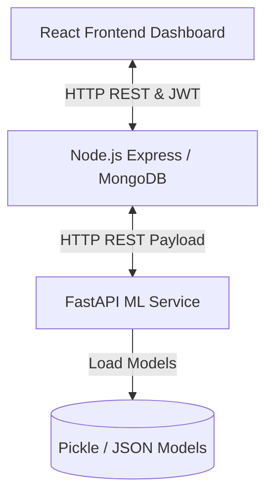

# 🧠 NeuroVerse: Full Team Architecture & Developer Guide

Welcome to the **NeuroVerse** Machine Learning and Backend Developer Onboarding Guide! This document is designed to get new team members fully oriented with the decoupled system architecture, core predictive engines, repository folder structure, and individual team responsibilities.

---

## 1. 🎯 The "Why" Behind NeuroVerse (Project Motivation)

Higher education environments expose students to intense academic, social, and financial stressors, frequently resulting in anxiety, depression, or burnout. Despite the prevalence of these issues, a vast majority of students do not seek clinical help due to social stigma, high therapy costs, and a lack of continuous self-monitoring tools.

Existing software options are highly fragmented: students must switch between disparate apps for habit tracking, journaling, or scheduling therapist appointments. This limits long-term engagement and prevents campus counselors from receiving early alerts when a student enters a high-risk crisis state.

### Why a Decoupled Architecture?
To solve these challenges in a unified platform, **NeuroVerse** splits its operations into a decoupled, three-tier model:

1. **Frontend Presentation Tier (React & Vite):** Delivers clean dashboards, wellness logger widgets, community forums, and therapist booking views.
2. **Main Business Logic Tier (Node.js & Express):** Manages user session authentication (JWT), database operations (MongoDB), payment routing, and dashboard widgets.
3. **Machine Learning Microservice (FastAPI):** An isolated, high-performance service dedicated purely to mathematical model training, low-latency text classifications, keyword search index lookups, and graph traversals.

> [!IMPORTANT]
> **Performance Rationale:**
> Node.js operates on a single-threaded event loop. If heavy CPU-bound machine learning tasks (like text preprocessing, TF-IDF vectorization, Logistic Regression inferences, and NetworkX DFS traversals) were run directly inside Node.js, the event loop would block. This would cause all concurrent user requests—such as authenticating users, booking therapists, or browsing forums—to experience severe latency spikes or time out. 
> 
> Decoupling the ML logic into a specialized FastAPI server running in isolation ensures the Node.js API remains highly responsive, even under heavy concurrent user inference loads.

---

## 2. 🗺️ Complete System Blueprint & Data Flow

Below is the conceptual blueprint mapping the data movement across the system tiers:

### Detailed Data Flow: Journal Sentiment Triage Pipeline
When a student logs a journal reflection on the dashboard, the following sequence occurs:

1. **User Action:** The student writes a journal entry in the React frontend and clicks "Save".
2. **Web Request:** The frontend makes an HTTP `POST` request to the Node.js server with the reflection text and the user's JWT authorization token.
3. **Authentication Check:** Node.js verifies the JWT to identify the student and protect user privacy.
4. **FastAPI Bridge:** Node.js forwards the raw text in an HTTP `POST` payload to the FastAPI `/api/ml/analyze-sentiment` endpoint.
5. **Inference pipeline:**
   * FastAPI cleans the text (removing punctuation, lowercasing, and normalizing whitespace).
   * The cleaned text is transformed into a sparse feature vector using the pre-trained `TfidfVectorizer` (5,000 max features, 1-2 n-grams).
   * The vector is classified using the Logistic Regression model.
   * If a `CRISIS` tag is assigned, the microservice flags `requires_crisis_support: true` in the JSON response.
6. **Data Persistence:** FastAPI returns the classification result and confidence level back to Node.js. Node.js writes the journal entry, text sentiment label (`NEUTRAL`, `NEGATIVE`, or `CRISIS`), and metadata into MongoDB.
7. **Frontend Alert Trigger:** Node.js sends the entry object back to the React client. If `requires_crisis_support` is true, the frontend client immediately intercepts the response and pops up a modal displaying emergency campus support hotlines and therapist booking shortcuts.

---

## 3. 📊 The 5 Core Engines

NeuroVerse implements 5 distinct algorithms and pipelines:

### 1. Mood Score Regressor
* **Endpoint:** `POST /api/ml/predict-mood`
* **Implementation File:** [predict.py](file:///d:/Study/Projects/NeuroLink/ml-service/routers/predict.py)
* **Description:** Predicts a continuous student mood score between $1.0$ (Very Low) and $5.0$ (Excellent) based on demographic inputs (gender, age, year of study, CGPA, and marital status).
* **Target Variable:** The target variable ($Score_{\text{mood}}$) is engineered using a normalized mental health penalty ($Score_{\text{mh}}$) calculated from self-reported depression ($D$), anxiety ($A$), and panic ($P$) checkboxes:
  $$Score_{\text{mh}} = (3 \times D) + (2 \times A) + (1 \times P)$$
  $$Score_{\text{mood}} = 5.0 - \left( \frac{Score_{\text{mh}}}{6} \times 4.0 \right)$$
* **Target Leakage Elimination:** 
  > [!WARNING]
  > Initial models achieved $R^{2}=1.000$ because the training matrices $X$ included the $D$, $A$, and $P$ indicators. Since the target variable is directly computed from these flags, the model memorized the coefficients. We solved this target leakage by completely pruning these flags from the training matrix at the source:
  > $$X_{clean} = [\text{gender\_encoded}, \text{Age}, \text{year\_encoded}, \text{cgpa\_encoded}, \text{marital\_encoded}]$$
  > The FastAPI endpoint accepts the full frontend request payload but ignores the clinical checkboxes during demographic prediction.

### 2. Text Sentiment Triage Classifier
* **Endpoint:** `POST /api/ml/analyze-sentiment`
* **Implementation File:** [predict.py](file:///d:/Study/Projects/NeuroLink/ml-service/routers/predict.py)
* **Description:** Triages journal text entries into `NEUTRAL`, `NEGATIVE`, or `CRISIS` states.
* **Vectorization:** Text reflections are transformed using a custom text cleaner and a `TfidfVectorizer` configured with a maximum of 5,000 features and an n-gram range of 1-2 (unigrams and bigrams).
* **Model Selection:** We evaluate Logistic Regression, SVM, and Random Forest. Logistic Regression is selected for production, achieving **81.8%** accuracy and executing inferences in under 15ms with minimal memory consumption.

### 3. Sleep Lifestyle Insights Engine
* **Endpoint:** `POST /api/ml/sleep-insights`
* **Implementation File:** [predict.py](file:///d:/Study/Projects/NeuroLink/ml-service/routers/predict.py)
* **Description:** Evaluates habits and sleep records using static threshold rules and a calculated sleep score.
* **Rules Engine:** Standardizes input variables (sleep hours, stress level, and sleep quality score) and detects anomalies. For instance, if sleep hours are less than 6, or stress levels are greater than 7, the engine maps recommendations (habits, articles, exercises) and flags the detected issues.

### 4. FAQ Keyword Matcher
* **Endpoint:** `GET /api/ml/faq-search`
* **Implementation File:** [predict.py](file:///d:/Study/Projects/NeuroLink/ml-service/routers/predict.py)
* **Description:** Tokenizes natural language questions, removes NLTK stopwords, filters words with length $\le 3$, and matches remaining query keywords against a pre-indexed FAQ dictionary (parsed from `Mental_Health_FAQ.csv`), returning the top 3 relevant entries.

### 5. Knowledge Graph Pathfinder
* **Endpoints:** `POST /api/ml/build-graph` and `POST /api/ml/recommend-path`
* **Implementation File:** [learning.py](file:///d:/Study/Projects/NeuroLink/ml-service/routers/learning.py)
* **Description:** Connects articles, resources, and wellness courses into a semantic network.
* **Graph Architecture:** Generates dense vector embeddings of course metadata using a pre-trained SentenceTransformer (`all-MiniLM-L6-v2`) model. Cosine similarities between embeddings are calculated, and edges are added to a `NetworkX` graph if similarity exceeds $0.5$.
* **Traversal:** `/recommend-path` embeds the user's profile/interests, matches them to the top 3 closest starting nodes in the graph, and runs a **Depth First Search (DFS) preorder traversal** to extract a sequenced wellness recommendation pathway.

---

## 4. 📂 Project Folder Tour Guide

Understanding our repository layout is key to finding files quickly:

* **`/models` (Workspace Root):** Stores the production serializations (`.pkl` and `.json`) loaded by the FastAPI endpoints.
  * `mood_predictor.pkl` - Trained Linear Regression mood regressor.
  * `mood_scaler.pkl` - `StandardScaler` used to normalize demographic inputs.
  * `sentiment_classifier.pkl` - Trained Logistic Regression multi-class sentiment classifier.
  * `tfidf_vectorizer.pkl` - `TfidfVectorizer` used to extract text features.
  * `sentiment_label_encoder.pkl` - Maps index labels back to `NEUTRAL`, `NEGATIVE`, or `CRISIS`.
* **`/ml-service` (FastAPI Server):** Contains the python server implementation.
  * `main.py` - Core entry point initializing the FastAPI server, CORS middleware, and mounting routers.
  * `ml_models.py` - Preloads all pickle models and JSON configuration files into memory at startup.
  * `routers/` - Implementations of endpoints (`predict.py`, `learning.py`, `chat.py`).
  * `training/` - Scripts used to preprocess raw datasets, train models, and output visual plots (`train_all_models.py`, `generate_presentation_data.py`).
* **`/server` (Node.js/Express Server):** Main backend application folder.
  * `controllers/` - Route controllers bridging database CRUD and ML queries (`ml.js`, `journal.js`, `mood.js`, `learning.js`).
  * `models/` - Mongoose schemas defining database structures (`JournalEntry.js`, `ForumPost.js`, `Therapist.js`).
* **`/client` (React/Vite Frontend):** Contains UI code.
  * `src/components` & `src/views` - Dashboard, journal logging widgets, and community forums.

---

## 5. 👥 Team Responsibility & Ownership Allocation

Our machine learning code ownership is split across the following team responsibilities:

1. **Wasiur Rahman Sakib (Lead/Backend):**
   * Manages microservice architecture connections (REST API endpoints).
   * Oversees target engineering math, scaler normalizations, and overall pipeline performance.
   * *Contact points:* `ml-service/main.py`, `ml-service/routers/predict.py`.

2. **Faiza Binti Akbar (Literature/Insights):**
   * Oversees the sleep insights rules config and threshold parameters.
   * Maps scientific/demographic study conclusions to domain baselines.
   * *Contact points:* `ml-service/models/` (sleep configurations), `server/controllers/ml.js`.

3. **Jinnat Akter Afrin (NLP Developer):**
   * Manages text cleaning preprocessing functions, stopword dictionaries, and TF-IDF parameters.
   * Trains and optimizes text sentiment classification models.
   * *Contact points:* `ml-service/routers/predict.py` (sentiment endpoint), `ml-service/training/train_all_models.py`.

4. **Md. Annan (Graph Engineer):**
   * Owns the NetworkX semantic graph structure and SentenceTransformer embedding calibrations.
   * Updates DFS preorder traversal pathfinder logic and embedding parameters.
   * *Contact points:* `ml-service/routers/learning.py`, `ml-service/knowledge_graph.pkl`.

5. **Mahadi Hasan Tanmay (Testing/FAQ):**
   * Fine-tunes the tokenization FAQ indexer and keyword relevance scores.
   * Manages test assertions, performance metrics plots, and pickle validation scripts.
   * *Contact points:* `ml-service/training/generate_final_plots.py`, `ml-service/routers/predict.py` (faq search).
