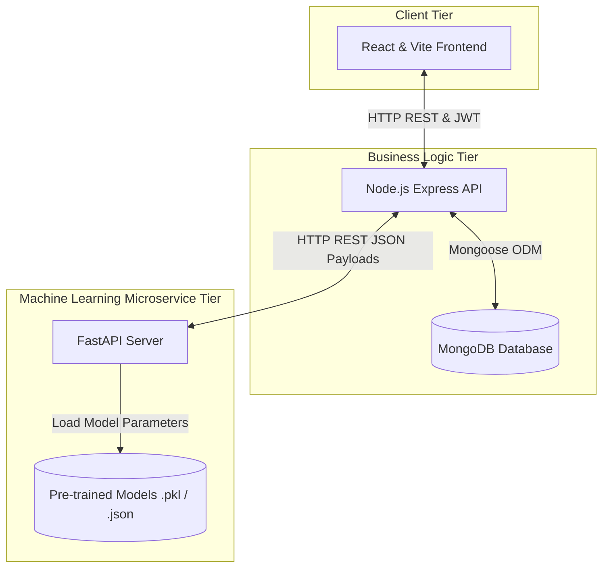

# 🧠 NeuroVerse: The AI-Integrated Student Wellness Platform

NeuroVerse (also referred to as NeuroLink) is a state-of-the-art digital health application that integrates machine learning pipelines with student wellness dashboards to deliver low-latency mental health monitoring, sentiment triage, lifestyle correlation insights, and personalized guided learning pathways.

---

## 1. 🎯 What is NeuroVerse? (Project Overview)

### The Student Wellness Crisis
Modern higher education presents extreme academic, social, and economic stressors. Students frequently experience clinical anxiety, depression, and burnout. However, severe social stigma, the high cost of therapy, and fragmented, slow campus support tools prevent students from seeking help early. 

### The Vision
**NeuroVerse** solves this problem by providing a secure, centralized wellness platform. It merges self-guided habit/mood logs, daily journaling, and an automated crisis triage engine with a therapist booking marketplace. When a student writes a private journal entry, the system automatically runs real-time sentiment triage. If severe distress is detected, the platform immediately provides crisis support pathways. It gives institutions a secure way to offer students resources while maintaining privacy.

---

## 2. ⚙️ Core System Functionalities

The platform is designed around 5 core functionalities, each powered by a custom ML pipeline:

| Feature | User Experience | Underlying ML Algorithm / Engine |
| :--- | :--- | :--- |
| **Demographic Mood Regressor** | Predicts a student's continuous mood trends over time using minimal, non-intrusive demographic details (CGPA, year of study, age). | Standardized Linear Regression model ($R^2 = 0.423$, $MAE = 0.727$). |
| **Journal Sentiment Triage** | Real-time sentiment scanner that classifies daily journal reflections and flags high-risk thoughts. | TF-IDF Vectorizer (5,000 features) + Logistic Regression Classifier (Accuracy: $81.8\%$, Crisis $F_1: 0.77$). |
| **Sleep & Stress Tracker** | Imputes missing habits, analyzes physical activity patterns, and outputs custom sleep suggestions. | Pearson Correlation Coefficient matrix analysis & rule-based insight templates. |
| **Instant FAQ Search** | Fast, tokenized local search index that maps user queries to immediate mental health answers. | NLTK Stopword tokenization and high-relevance keyword frequency index. |
| **Guided Learning Paths** | Recommends a sequential, non-overwhelming path of wellness topics (e.g., CBT, breathing guides). | SentenceTransformer (`all-MiniLM-L6-v2`) embeddings + NetworkX Cosine Similarity Graph + DFS Traversal. |

---

## 3. 🏗️ Architecture & System Blueprint

To support high user concurrency and low-latency inferences, NeuroVerse uses a decoupled, three-tier architecture:

### Detailed Journal Sentiment Triage Pipeline:
1. **Frontend Input:** Student writes a reflection on their dashboard and clicks "Log Entry".
2. **Logic Dispatch:** The React client sends the entry via HTTP `POST` to the Node.js Express server.
3. **ML Microservice Call:** Node.js forwards the raw text payload to the FastAPI `/api/ml/analyze-sentiment` endpoint.
4. **NLP Inference:** FastAPI cleans the text, runs it through the TF-IDF vectorizer, and classifies it using the Logistic Regression model.
5. **Database Log:** FastAPI returns the classification. If flagged as `CRISIS`, Node.js immediately sets `requires_crisis_support: true` in MongoDB.
6. **UI Alert Trigger:** The API response is returned to the frontend. If the crisis flag is active, the React app immediately displays emergency counseling hotlines and therapist appointment links.

---

## 4. 💥 Technical & Algorithmic Challenges

During development, five primary technical hurdles were resolved:

### Challenge 1: CPU-Bound Event Loop Blocking in Node.js
* **The Problem:** Running heavy text tokenization, TF-IDF vector calculations, model predictions, and graph searches directly inside Node.js blocked its single-threaded event loop. Under concurrent user activity, simple backend queries (like user logins or therapist scheduling) experienced severe latency spikes or timed out.
* **The Solution:** Decoupled the machine learning engine into a standalone FastAPI microservice running asynchronously. Node.js processes lightweight business requests and communicates with FastAPI using fast HTTP REST payloads.

### Challenge 2: The "100% Accuracy" Target Leakage Bug
* **The Problem:** Initial evaluations of the Demographic Mood Regressor reported $R^2 = 1.000$ and $MAE = 0.000$. Investigation revealed that the feature matrix $X$ included self-reported binary indicators for Depression, Anxiety, and Panic. Since the target variable $Score_{\text{mood}}$ was calculated as a direct mathematical scaling of these metrics, the model simply memorized the linear weights, making it completely useless for demographic generalization.
* **The Solution:** Removed all clinical indicators from the training feature matrix $X$, leaving only demographics:
  $$X_{clean} = [\text{gender\_encoded}, \text{Age}, \text{year\_encoded}, \text{cgpa\_encoded}, \text{marital\_encoded}]$$
  The clinical checkboxes are handled separately, and the regression model generalized to demographic trends with a realistic $R^2$ of $0.423$.

### Challenge 3: Computational Latency with Deep NLP Models
* **The Problem:** Deep learning models (like LSTMs or pre-trained LLMs) achieved high accuracy but suffered from high computational latency (150ms - 500ms) and required heavy GPU resources. This is impractical for real-time triage during user typing or continuous journal logs.
* **The Solution:** Implemented a classical TF-IDF Vectorizer with a multi-class Logistic Regression classifier. The model achieves competitive accuracy ($81.8\%$) while maintaining ultra-low inference latency ($\approx 15\text{ms}$) on standard CPU servers.

### Challenge 4: Recommender "Cold Start" Problem
* **The Problem:** A collaborative-filtering recommender system needs historical ratings to suggest wellness modules. New users on the platform received no suggestions.
* **The Solution:** Built a content-based Semantic Knowledge Graph. Content descriptions are embedded into dense 384-dimensional vectors using SentenceTransformers. Cosine similarity matrices are calculated, and edges are added to a `NetworkX` graph if similarity exceeds $0.5$. Structured paths are then traversed using Depth First Search (DFS).

### Challenge 5: LaTeX Compilation Page Breaks & Table Margins
* **The Problem:** During the preparation of the academic report, compiled tables were cutting off at margins, and LaTeX was forcing empty pages (gaps) before tables and bibliography chapters due to default float placements.
* **The Solution:** Fixed compile gaps by relaxing page-breaks (`\let\clearpage\relax`) during the table of contents and references listings. Fused table margins were resolved by wrapping tabular data blocks inside a dynamic scaling box: `\resizebox{\textwidth}{!}{% ... }`.

---

## 5. 📈 Empirical Metrics & Performance Summary

### Mood Regressor Performance
Models were evaluated on demographic predictions using the `Student Mental health.csv` dataset (80-20 train-test split):

| Regression Model | Coefficient of Determination ($R^2$) | Mean Absolute Error ($MAE$) |
| :--- | :---: | :---: |
| **Linear Regression (Selected)** | **0.423** | **0.727** |
| Random Forest Regressor | 0.385 | 0.764 |
| Gradient Boosting Regressor | 0.398 | 0.742 |

### Sentiment Classifier Performance
Sentiment classifiers were trained on combined text corpuses (stratified 80-20 split) to classify entries into *NEUTRAL*, *NEGATIVE*, and *CRISIS*:

| Classification Model | Precision | Recall | F1-Score | Overall Accuracy |
| :--- | :---: | :---: | :---: | :---: |
| **Logistic Regression** | **0.81** | **0.82** | **0.81** | **81.8%** |
| Support Vector Machine (SVM) | 0.81 | 0.82 | 0.81 | 81.7% |
| Random Forest Classifier | 0.80 | 0.81 | 0.80 | 81.0% |

#### Production Logistic Regression Classification Report:
* **CRISIS:** Precision = `0.78` \| Recall = `0.75` \| **F1-Score = `0.77`**
* **NEGATIVE:** Precision = `0.80` \| Recall = `0.75` \| **F1-Score = `0.78`**
* **NEUTRAL:** Precision = `0.86` \| Recall = `0.92` \| **F1-Score = `0.89`**

### Pearson Lifestyle Correlation Metrics
Evaluated on `Sleep_health_and_lifestyle_dataset.csv` to establish rules:
* **Sleep Duration & Quality of Sleep:** `+0.883` (Strong Positive)
* **Quality of Sleep & Stress Level:** `-0.898` (Strong Negative)
* **Sleep Duration & Stress Level:** `-0.811` (Strong Negative)
* **Physical Activity & Quality of Sleep:** `+0.278` (Moderate Positive)

---

## 6. 🚀 Future Scope & Upgrades

The roadmap for NeuroVerse includes:
1. **Local Retrieval-Augmented Generation (RAG):** Replacing static keyword FAQ matching with semantic search querying an offline, secure local LLM (e.g., Llama-3-8B) for personalized Q&A.
2. **Wearable Biosensors Integration:** Pulling real-time heart rate variability (HRV) and sleep stages via Google Fit and Apple HealthKit APIs.
3. **Multimodal Emotion Detection:** Integrating voice acoustics and facial expression video inputs to enhance the crisis detection triage engine.
